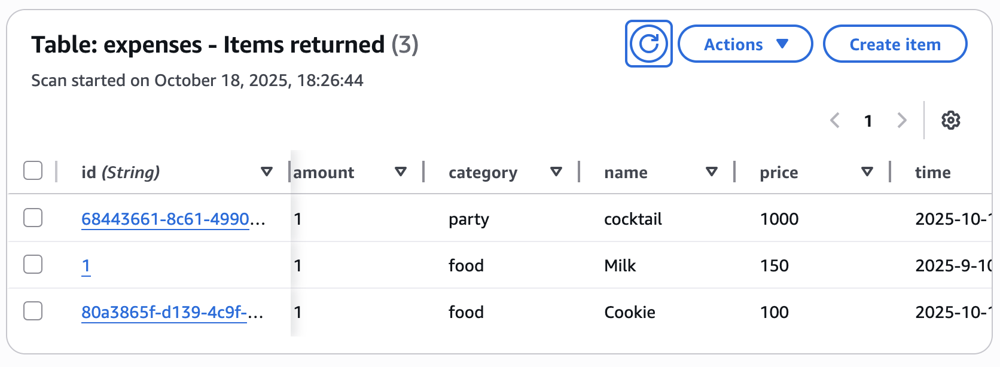
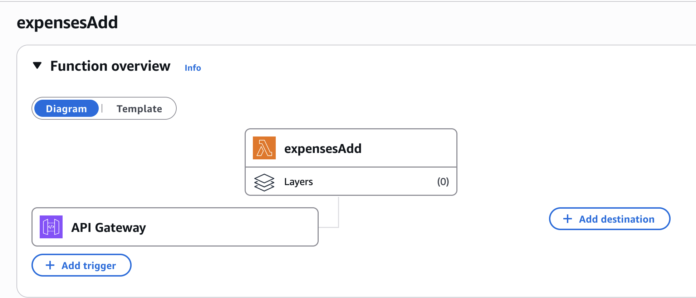

# Expenses API

This project implements a simple **Expenses Management API** using **AWS Lambda**, **API Gateway** and **DynamoDB**.

---

## Table of Contents

- [Environment](#environment)
- [API Endpoints](#api-endpoints)
  - [Get All Expenses](#get-all-expenses)
  - [Get Expenses by Category](#get-expenses-by-category)
  - [Get Expenses by Period](#get-expenses-by-period)
  - [Get Expenses Sorted by Key](#get-expenses-sorted-by-key)
  - [Add Expense](#add-expense)
- [Data Model](#data-model)
- [Notes](#notes)
- [Gallery](#gallery)

---

## Environment

- **AWS Services**: Lambda, API Gateway, DynamoDB
- **Runtime**: Python 3.10+
- **IAM Permissions**:
  - DynamoDB: `GetItem`, `PutItem`, `Scan`, `Query`

---

## API Endpoints

### Get All Expenses

- **Endpoint**: `GET /getExpenses`
- **Description**: Retrieves all items from the `expenses` table.
- **Query Parameters**: none
- **Response**:

```json
[
  {
    "id": "1",
    "name": "Milk",
    "category": "food",
    "amount": 1,
    "price": 150.0,
    "time": "2025-9-10"
  },
  ...
]
```

---

### Get Expenses by Category

- **Endpoint**: `GET /expensesCategory`
- **Query Parameter**: `category=<category_name>`
- **Description**: Filters items by category.
- **Example**: `/expensesCategory?category=food`

---

### Get Expenses by Period

- **Endpoint**: `GET /expensesPeriod`
- **Query Parameters**:
  - `from=YYYY-MM-DD`
  - `to=YYYY-MM-DD`
- **Description**: Retrieves items whose dates fall within the specified period.
- **Example**: `/expensesPeriod?from=2025-10-01&to=2025-10-18`

---

### Get Expenses Sorted by Key

- **Endpoint**: `GET /expensesSorted`
- **Query Parameter**: `key=<attribute>`
- **Description**: Sorts all items by the specified attribute (`price`, `amount`, `time`, etc.).
- **Example**: `/expensesSorted?key=price`
- **Response**: List sorted in ascending order by the given key.

---

### Add Expense

- **Endpoint**: `POST /expensesAdd`
- **Body** (JSON):

```json
{
  "id": "2",
  "name": "Cookie",
  "category": "food",
  "amount": 1,
  "price": 100.0,
  "time": "2025-10-17"
}
```

- **Description**: Adds a new expense to the `expenses` table.

---

## Data Model

`expenses` table (DynamoDB):

| Attribute | Type   | Description       |
| --------- | ------ | ----------------- |
| id        | String | Unique identifier |
| name      | String | Item name         |
| category  | String | Category          |
| amount    | Number | Quantity          |
| price     | Number | Price             |
| time      | String | Date (YYYY-MM-DD) |

---

## Notes

- All numbers from DynamoDB (`Decimal`) are converted to `float` for JSON serialization.

## Gallery



